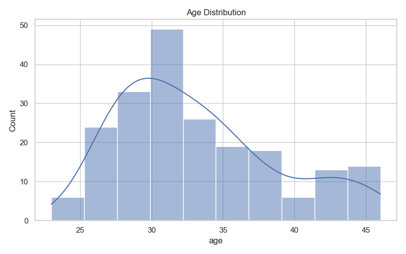
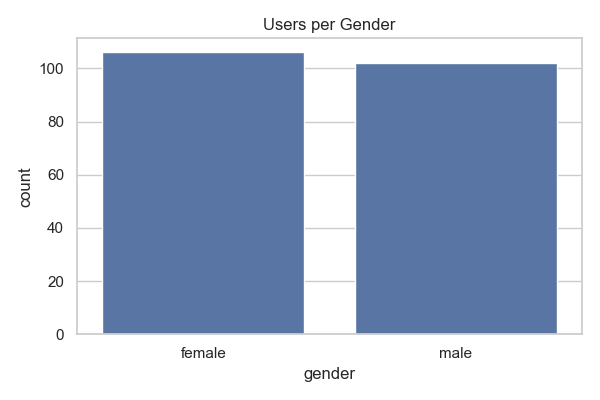
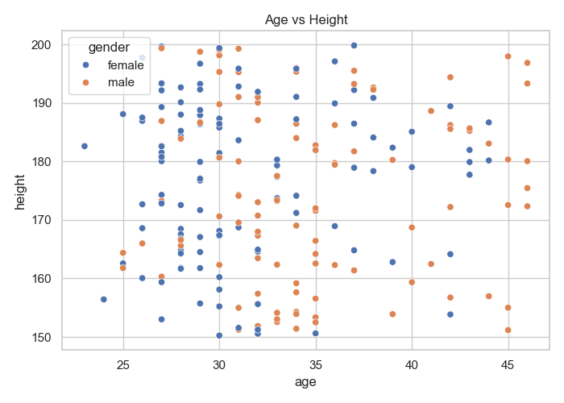
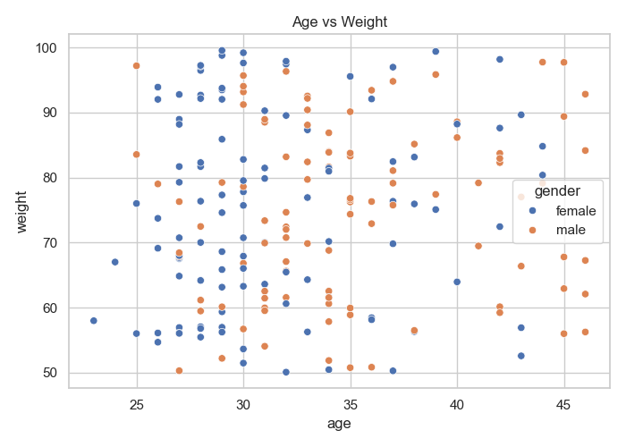

📊 DummyJSON Users Data Analysis

A Python-based data analysis project that explores user demographics using data fetched from the DummyJSON API.

🚀 Project Overview

This project analyzes user data retrieved from the DummyJSON API and demonstrates a complete data analysis workflow, including:

Fetching data from a REST API

Data cleaning and preparation

Exploratory Data Analysis (EDA)

Statistical analysis

Data visualization using Seaborn

Organizing results in a professional GitHub project structure

🧩 Project Structure
dummyjson-users-analysis/
│
├── data/
│   └── users_data.csv
│
├── src/
│   └── fetch_users.py
│
├── notebooks/
│   └── analysis.ipynb
│
├── outputs/
│   ├── avg_age_by_gender.csv
│   ├── users_per_gender.csv
│   ├── top10_cities.csv
│   └── summary_stats_numeric.csv
│
├── plots/
│   ├── plot1_age_distribution.png
│   ├── plot2_users_per_gender.png
│   ├── plot3_avg_age_by_gender.png
│   ├── plot4_age_vs_height.png
│   └── plot5_age_vs_weight.png
│
├── requirements.txt
└── README.md
📈 Key Analysis Performed

Average age of users

Average age grouped by gender

Number of users per gender

Top 10 cities with the highest number of users

Average height and weight

Relationship between age and height / weight

📊 Sample Visualizations

   
 
   

🧠 Key Findings

The average age of users is approximately in the mid-30s.

Age distribution is relatively balanced across genders.

No strong correlation was found between age and height or weight.

Some cities show significantly higher user concentration than others.

🛠️ Tools & Libraries Used

Python

Pandas

NumPy

Requests

Seaborn

Matplotlib

▶️ How to Run the Project
1️⃣ Install dependencies
pip install -r requirements.txt
2️⃣ (Optional) Fetch data from the API
python src/fetch_users.py
3️⃣ Run the analysis

Open the Jupyter Notebook:

notebooks/analysis.ipynb
🎓 Academic Context

This project was developed as part of an ITI Data Analysis Lab, focusing on:

Practical data analysis skills

Working with REST APIs

Writing clean, readable, and reusable code

Structuring professional GitHub repositories

👤 Author

Mohamed Ashraf
ITI – Data Analysis Track

⭐ If you find this project useful, feel free to explore the repository.