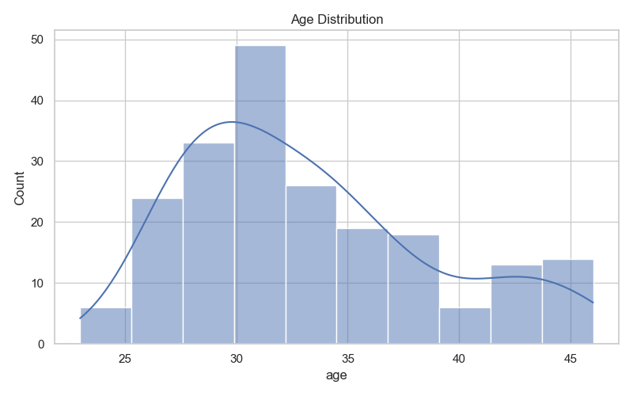
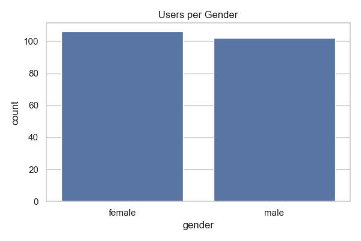
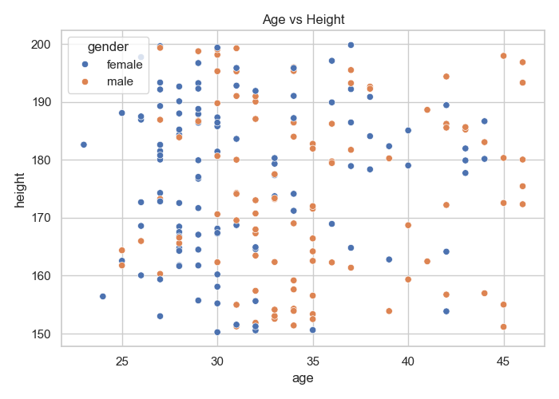
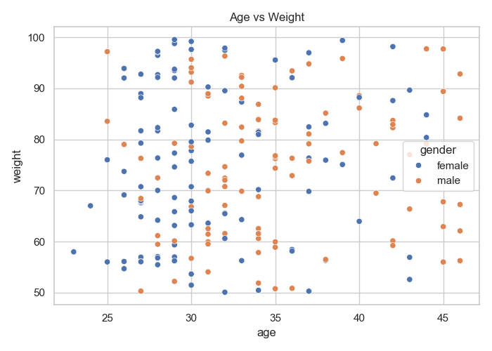

# 📊 DummyJSON Users Data Analysis


A Python-based data analysis project that explores user demographics using data fetched from the DummyJSON API.  
The project includes a fully automated pipeline and Docker support.

---

## 🚀 Project Overview

This project demonstrates a complete data analysis workflow:

- Fetching data from a REST API  
- Cleaning and preparing the dataset  
- Exploratory Data Analysis (EDA)  
- Statistical analysis  
- Data visualization using Seaborn  
- Automated execution using Docker  

---

## 🧩 Project Structure

```bash
dummyjson-users-analysis/
│
├── data/                    # Generated raw data (CSV)
│   └── users_data.csv
│
├── src/
│   └── run_pipeline.py      # End-to-end automated pipeline
│
├── notebooks/
│   └── analysis.ipynb       # Exploratory notebook
│
├── outputs/                 # Manual analysis outputs
├── plots/                   # Manual visualizations
│
├── outputs_docker/          # Docker pipeline outputs
├── plots_docker/            # Docker pipeline visualizations
│
├── Dockerfile
├── .dockerignore
├── requirements.txt
└── README.md
```

---

## 📈 Key Analysis

- Average age of users  
- Average age by gender  
- User distribution by gender  
- Top 10 cities by user count  
- Average height and weight  
- Correlation between age and physical attributes  

---

## 📊 Sample Visualizations

<p align="center">
  
  
</p>

<p align="center">
  
  
</p>

---

## 🛠️ Technologies Used

- Python  
- Pandas  
- NumPy  
- Requests  
- Seaborn  
- Matplotlib  
- Docker  

---

## ▶️ How to Run

### Option 1 — Local Execution

Install dependencies:

```bash
pip install -r requirements.txt
```

Run the pipeline:

```bash
python src/run_pipeline.py
```

Generated outputs will be saved in:

- `outputs_docker/`
- `plots_docker/`

---

### Option 2 — Docker (Recommended)

Build the image:

```bash
docker build -t dummyjson-users-analysis .
```

Run the container:

**Windows (PowerShell):**

```powershell
docker run --rm `
 -v "${PWD}\outputs_docker:/app/outputs_docker" `
 -v "${PWD}\plots_docker:/app/plots_docker" `
 -v "${PWD}\data:/app/data" `
 dummyjson-users-analysis
```

**Linux / macOS:**

```bash
docker run --rm \
 -v "$(pwd)/outputs_docker:/app/outputs_docker" \
 -v "$(pwd)/plots_docker:/app/plots_docker" \
 -v "$(pwd)/data:/app/data" \
 dummyjson-users-analysis
```

---

## 🎓 Context

Developed as part of an ITI Data Analysis Lab, with a focus on:

- Structured data workflows  
- API integration  
- Clean repository organization  
- Production-oriented automation  

---

## 👤 Author

Mohamed Ashraf  
ITI – Data Engineering Track  

---

If you find this project useful, feel free to explore the repository.